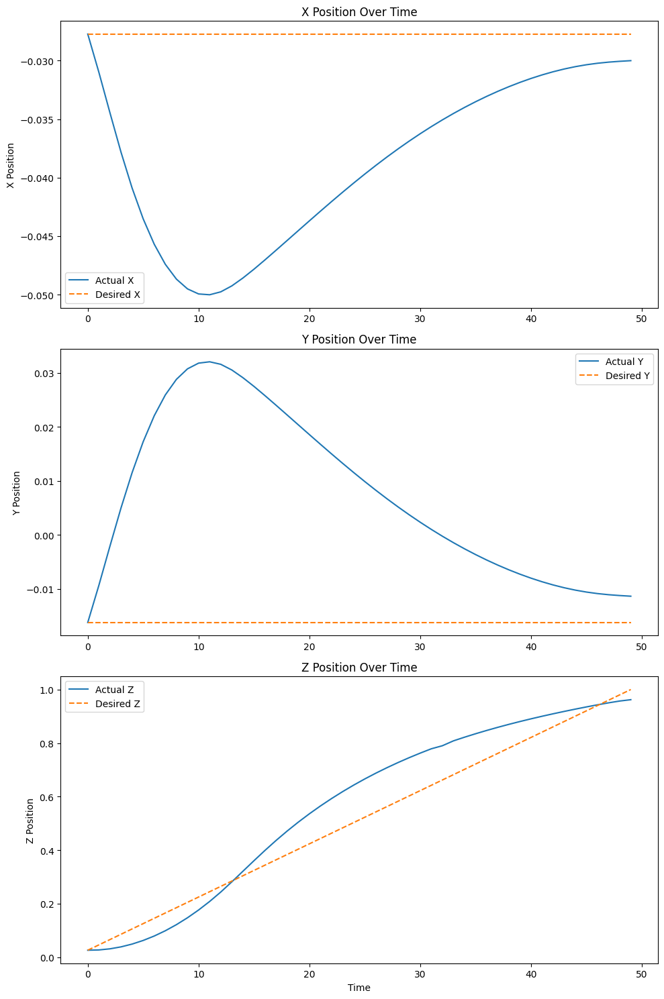

# From Ground to Air: Crazyflie Drone Takeoff with Model Predictive Control

## Table of Contents
1. [Overview](#overview)
2. [Problem Statement](#problem_statement)
3. [Results](#results)
4. [Setup and Run the project](#running_project)
5. [Appendix](#appendix)
6. [Bibliography](#bibliography)

## Overview <a id="overview"></a>
This section provides a brief introduction to the project conducted as part of the Advanced Control Methods course at Skoltech in 2024. It includes the fundamental objectives of the project, information about the team members, and a link to the final presentation.

- Course: Advanced Control Methods, Skoltech, 2024
- Team Members: Lavanya Ratnabala , Selamawit Asfaw
- Final Presentation: [MPC Takeoff](https://docs.google.com/presentation/d/1lm82zUs13wzlbzYoQ151rFkZ4N4f6DnRfFaLImc0srU/edit?usp=sharing)

### Why Takeoff is important
In the last decade, drones have gained immense popularity, revolutionizing sectors like agriculture, surveillance, delivery, and entertainment with their efficiency, precision, and automation. However  takeoff phase involves complex dynamics due to the interactions between the UAV’s propulsion system and environmental factors like wind and turbulence.  Improper takeoff can lead to crashes or unstable flight paths, posing safety risks to nearby people and structures and potential mission failure. 

## Problem Statement <a id="problem_statement"></a>
Traditional control methods like PID controllers often struggle with the precision and proactive adjustments required during the takeoff phase of drone flights, particularly in handling dynamic external forces such as wind and turbulence. These external forces can introduce instabilities that are not effectively anticipated by reactive control systems, leading to potential safety risks and inefficiencies during takeoff. Model Predictive Control (MPC) to manage the Crazyflie drone's takeoff phase. MPC enhances takeoff stability and accuracy by using a dynamic model to predict future states and adjust controls in real-time. 


## Results <a id="results"></a>
The implemented MPC controller successfully worked on real drones using motion capture and VICON tracking stabilizes the drone at the desired takeoff point:

-By leveraging MPC, the drone is able to proactively predict and achive the takesoff. Additionally, the use of MPC reduces the occurrence of instabilities and enhances the safety and reliability of the takeoff process.
-Empirical data shows a marked small deviation from the planned takeoff path and a more consistent achievement of desired altitude and orientation targets.


### Visual Results
We conduct this testing  in real drone. Here we attach our results from ros2.

1. **MPC Solution path in Rviz**
   
   
   
2. **MPC Solution path in X,Y,Z over time**
   
   
   
3. **Desired and Actual X,Y,Z over time**
   
   

4. **Optimized Control Input over time**
   
   


5. **Ros2 simulation for Takeoff**
   
   
   
6. **Real takeoff test with crazyflie 2.1**

   

## Setup and Run the project <a id="running_project"></a>

### Dependencies
### Acados 
Acados can be installed by following their [documentation](https://docs.acados.org/installation/index.html).

### ROS 2 Humble
ROS 2 Humble can be found [here](https://docs.ros.org/en/humble/Installation.html).

### Crazyswarm2 
Setup the crazyswarm2 package.Official documentation about setting up this package can be found [here](https://imrclab.github.io/crazyswarm2/installation.html). Here clone our  modified version of Crazyswarm2 package with attitude control.


## Crazyflie_MPC Setup and Launch Instructions

This guide provides step-by-step instructions to set up the  environment and launch the necessary nodes for simulation and control.

### Prerequisites

Ensure you have the following dependencies installed:
- ROS 2
- ACADOS library
- crazyswarm2
- Vicon Tracking motion capture system

### Setup
#### Setup the crazyflie 
Create object with correct marker positions in vicon tracker.
In the crazyswarm2 package go to config -> crazyflie.yaml file and config your crazyflie radio uri. you can find the uri by call cfclient in the terminal.and change the name of crazyflie as your vicon tracker object.
In the motioncapture.yaml file configure your correct marker positions.

#### Activate the Environment

Activate the Python virtual environment(Highly recommended to use python envirment):
```sh
source ~pathto/acados/env/bin/activate
```

#### Set Environment Variables
Source the ROS2 workspace
Export the necessary environment variables in bashrc and the current terminal:
```sh
export LD_LIBRARY_PATH=$LD_LIBRARY_PATH:"pathto/acados/lib"
export ACADOS_SOURCE_DIR="pathto/acados"
export PYTHONPATH=pathto/crazyflie-firmware/build:$PYTHONPATH
```

### Launch Simulation

#### Launch the Crazyflie Simulation

Start the Crazyflie simulation backend:
```sh
ros2 launch crazyflie launch.py backend:=sim
```

For real drones
```sh
ros2 launch crazyflie launch.py
```

#### Launch the multi agent mpc
```sh
ros2 launch crazyflie_mpc crazyflie_multiagent_mpc_launch.py
```

#### Checking the topics before execute takeoff
check the available topic names and find the poses
```sh
ros2 topic list
```
check the named drone publishing its positional and orientational data
```sh
ros2 topic echo cf_1/pose
```
#### Takeoff Command

Publish a take off command to all drones for testing:
```sh
ros2 topic pub /all/mpc_takeoff std_msgs/msg/Empty "{}"
```
#### Find the mpc solution and path and optimized control input from running this topics
check the mpc solution path
```sh
ros2 topic echo cf_1/mpc_solution_path
```
check the optimized control input
```sh
ros2 topic echo cf_1/cmd_attitude_setpoint
```

### Notes

- Ensure all dependencies are correctly installed and paths are set properly.
- Refer to the respective documentation for any issues related to ROS 2, Crazyflie, or ACADOS.
- In all terminal source ros2 and activate the acados.

## Appendix <a id="appendix"></a>

### System Dynamics and MPC Configuration

The Crazyflie drone's dynamics are governed by a model predictive control (MPC) strategy, designed to handle the complexities of real-time aerial navigation. Below is a detailed breakdown of the system's state variables, control inputs, dynamics model, and the MPC setup.

#### State Variables and Control Inputs

**State Variables (`x`):**
- `px, py, pz`: Position coordinates in the inertial frame (meters).
- `vx, vy, vz`: Velocity components along each axis (meters/second).
- `roll, pitch, yaw`: Euler angles for orientation (radians).

**Control Inputs (`u`):**
- `roll_c, pitch_c, yaw_c`: Commanded angles for roll, pitch, and yaw (radians).
- `thrust`: Commanded thrust (Newtons).

```plaintext
State vector (x): [px, py, pz, vx, vy, vz, roll, pitch, yaw]
Control vector (u): [roll_c, pitch_c, yaw_c, thrust]
```
#### Control and Dynamical Parameters
```bash
...
**Quadrotor Parameters:**
    mass = 0.027#0.028
    arm_length= 0.0397#0.044
    Ixx= 1.4e-5#2.3951e-5
    Iyy=1.4e-5#2.3951e-5
    Izz=2.17e-5#3.2347e-5
    cm=2.4e-6
    tau= 0.08

**MPC Parameters:**
    mpc_tf = 1.0
    mpc_N = 50
    control_update_rate = 50
...
```
#### Dynamics Model

The dynamics of the Crazyflie are formulated based on Newtonian physics, incorporating forces such as gravity, thrust, and aerodynamic drag, affecting its translational and rotational dynamics:

**Translational Dynamics:**
  $$\dot{px} = vx $$
  $$\dot{py} = vy $$
  $$\dot(pz) = vz $$
  $$\dot(vx) = (Thrust / m) * sin(pitch)$$
  $$\dot(vy) = -(Thrust / m) * cos(pitch) * sin(roll)$$
  $$\dot(vz) = -(Thrust / m) * cos(pitch) * cos(roll) + g $$

**Rotational Dynamics:**
 $$\dot(roll) = p + q * sin(roll) * tan(pitch) + r * cos(roll) * tan(pitch)$$
 $$\dot(pitch) = q * cos(roll) - r * sin(roll)$$
$$\dot(yaw) = q * sin(roll) / cos(pitch) + r * cos(roll) / cos(pitch)$$


### MPC Setup

**Cost Function:**
The MPC optimizes the following cost function to balance trajectory tracking and control efforts:

$$Cost = \sum_{i=0}^{N-1} (x_k - x_d)^T Q (x_k - x_d) + u_k - u_d)^T + R(u_k - u_d) + (x_N - x_d)^T Q_e(x_N - x_e)$$

Where:
 $$x_k$$ represents the state of the system at step k, $$x_d$$ is the reference state at step k, $$u_k$$ is the control input at step k, $$u_d$$ is the reference control input at step k, $$x_N$$ is the state at the end of the prediction horizon, $$x_e$$ is the reference state at the end of the prediction horizon, Q and R are the weighting matrices for the state and control input errors, respectively, Q_e is the weighting matrix applied at the terminal state.


## Bibliography <a id="bibliography"></a>
1.	“CrazySim: A Software-in-the-Loop Simulator for the Crazyflie Nano Quadrotor", Accepted ICRA 2024. Available: [https://www.mdpi.com/1996-1073/16/5/2143](https://coogan.ece.gatech.edu/papers/pdf/llanes2024crazysim.pdf)


